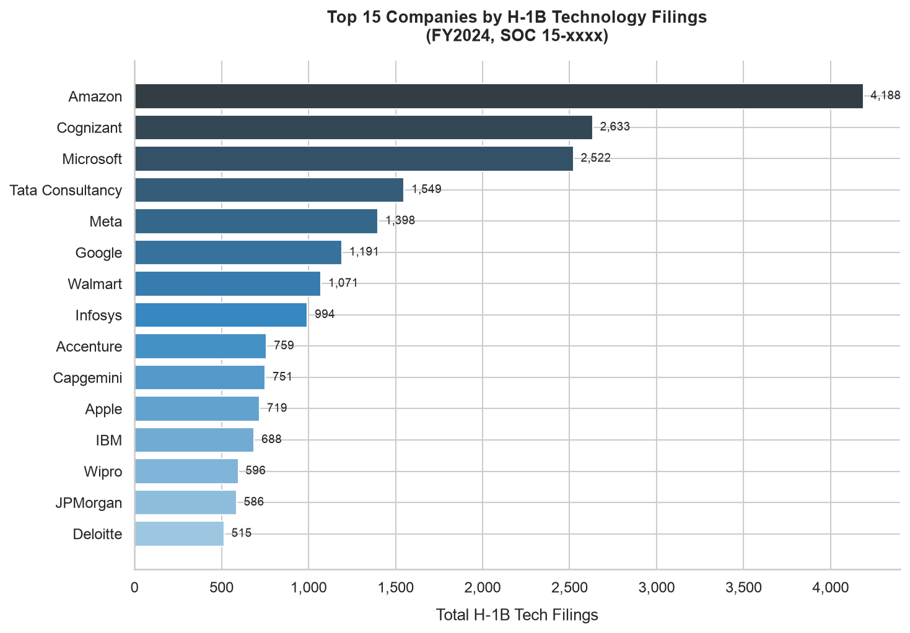
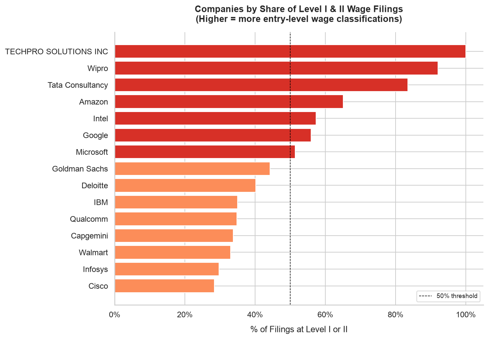
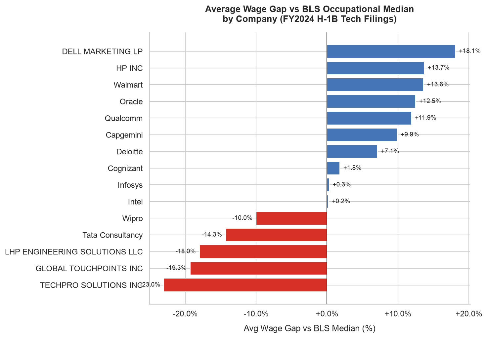
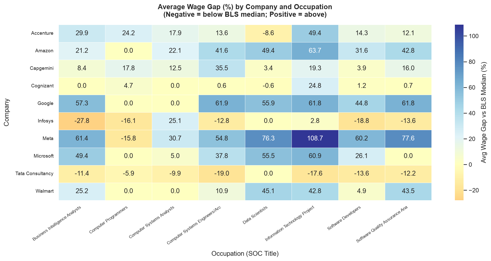

# H-1B Wage Level Analyzer

> Exploratory data analysis of U.S. Department of Labor H-1B visa application
> data to investigate wage classification patterns across major technology sponsors.

---

## Overview

This project analyzes **FY2024 DOL LCA disclosure data** for 20+ Fortune 500
companies to answer three core questions:

1. Which companies file the most H-1B tech applications?
2. How are prevailing wage levels (I–IV) distributed across companies?
3. How do offered wages compare to BLS occupational median benchmarks?

The analysis produces a company-level compensation gap ranking built from
560,000+ LCA records filtered to Computer & Mathematical occupations (SOC 15-xxxx).

---

## Business Motivation

Prevailing wage levels directly affect what H-1B workers are legally offered.
A company that files 80% of its roles at Level I is not doing anything illegal —
but it does signal a systematic preference for the lowest permissible wage floor.
This project quantifies those patterns to support pay equity research, talent
acquisition benchmarking, and candidate negotiation strategy.

---

## Tools & Technologies

| Category       | Tools                                      |
|----------------|--------------------------------------------|
| Language       | Python 3.12                                |
| Data wrangling | pandas, numpy                              |
| Database       | DuckDB (in-process SQL analytics)          |
| Visualization  | matplotlib, seaborn                        |
| Notebook       | Jupyter                                    |
| File formats   | Excel (.xlsx), CSV, SQL                    |

---

## Data Sources

| Dataset | Source | Description |
|---------|--------|-------------|
| DOL LCA Disclosure Data FY2024 | [dol.gov/agencies/eta/foreign-labor/performance](https://www.dol.gov/agencies/eta/foreign-labor/performance) | 560k+ H-1B/LCA applications with employer, SOC, wage, and wage-level fields |
| BLS OEWS National Data May 2024 | [bls.gov/oes/special.requests/oesm24nat.zip](https://www.bls.gov/oes/special.requests/oesm24nat.zip) | National occupational wage benchmarks (mean, median) by SOC code |

> Raw data files are excluded from this repo (see `.gitignore`).
> Download them from the links above and place in `data/raw/`.

---

## Methodology

```
DOL LCA Excel → clean_h1b.py → h1b_clean.csv
BLS OEWS Excel → clean_bls.py → bls_clean.csv
         ↓
     run_sql.py (DuckDB)
         ↓
  6 analytical query outputs (outputs/tables/)
  wage_gap = offered_wage - bls_median
  wage_gap_pct = wage_gap / bls_median * 100
         ↓
    visualize.py → 6 figures (outputs/figures/)
         ↓
  notebooks/h1b_analysis.ipynb (full narrative)
```

---

## Key Findings

- **Amazon** leads H-1B tech filings at 4,188 applications in FY2024
- **Wipro** (93%) and **Tata Consultancy** (83%) classify the highest share
  of filings at Level I or II prevailing wages
- **JPMorgan** and **Accenture** offered wages above the BLS median for
  matched occupations
- SOC code matching limitation reduced the BLS comparison sample;
  future work should address extended code crosswalks

---

## Folder Structure

```
h1b-wage-level-analyzer/
├── data/
│   ├── raw/          # Downloaded source files (not in repo)
│   └── processed/    # Cleaned CSVs (not in repo)
├── notebooks/        # Jupyter analysis notebook
├── sql/              # DuckDB schema and analysis queries
├── src/              # Python scripts (config, clean, sql, viz)
├── outputs/
│   ├── figures/      # 6 PNG visualizations
│   └── tables/       # 6 SQL query result CSVs
├── README.md
├── requirements.txt
└── .gitignore
```

---

## How to Run

```bash
# 1. Clone the repo and navigate into it
git clone https://github.com/YOUR_USERNAME/h1b-wage-level-analyzer.git
cd h1b-wage-level-analyzer

# 2. Create and activate virtual environment
python -m venv venv
source venv/bin/activate   # Windows: venv\Scripts\activate

# 3. Install dependencies
pip install -r requirements.txt

# 4. Download raw data files (see Data Sources above)
#    Place in data/raw/ with exact filenames from config.py

# 5. Run the full pipeline
python src/clean_h1b.py
python src/clean_bls.py
python src/run_sql.py
python src/visualize.py

# 6. Open the analysis notebook
jupyter notebook notebooks/h1b_analysis.ipynb
```

---

## Example Visualizations

| Fig 1: Top 15 Companies by Filings | Fig 3: Level I/II Share by Company |
|---|---|
|  |  |

| Fig 4: Wage Gap vs BLS Median | Fig 6: Heatmap by Company & Occupation |
|---|---|
|  |  |

---

## Limitations

- Wage-level classifications are lawful; this analysis is descriptive, not accusatory
- SOC code format mismatches between DOL and BLS data reduce join coverage
- Single fiscal year snapshot; multi-year trend analysis would strengthen findings
- Subsidiary and name variation may cause undercounting for some employers

## Future Improvements

- Expand to FY2020–FY2024 for time-series analysis
- Build a Streamlit dashboard for interactive company comparison
- Incorporate USCIS H-1B approval/denial data for denial rate analysis
- Add geographic wage adjustment using BLS metropolitan area data